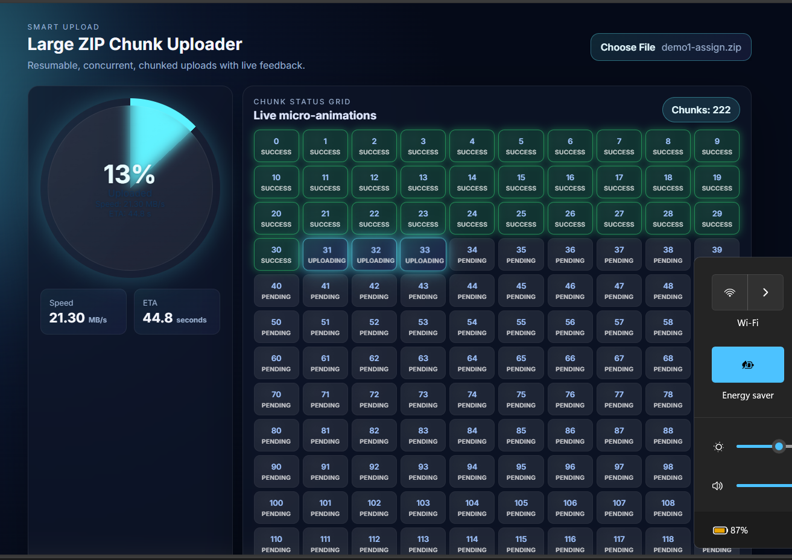
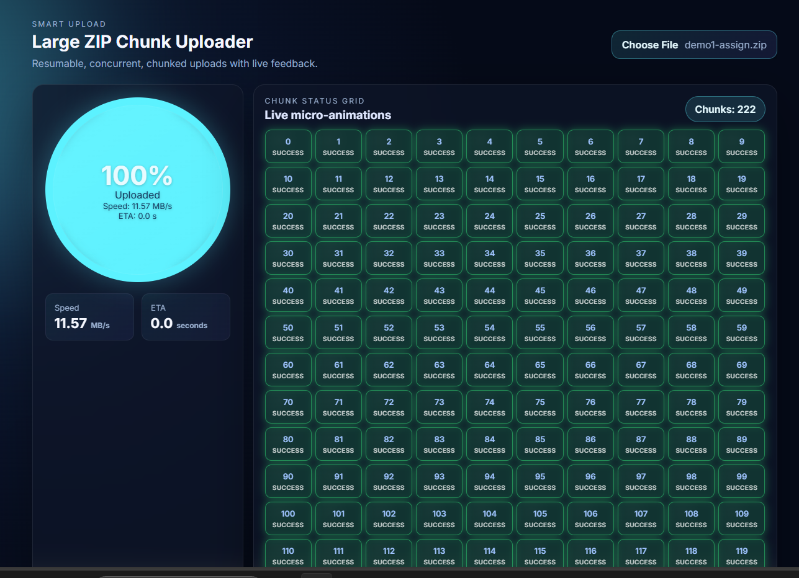

# Smart Uploader (Chunked ZIP Uploads)

A resumable, concurrent ZIP chunk uploader with a “Luminous” neon/glassmorphism UI, live chunk grid, speed/ETA analytics, and MongoDB persistence.

## Quick Start (Docker, Atlas)
1. Clone the Repository
   ```bash
   git clone https://github.com/gittyShiv/smart_uploader_VizExperts_assignment.git
   ```
   
3. Create `backend/.env` (not committed, see .env.example):
   ```env
   MONGO_URI=mongodb+srv://<user>:<pass>@<cluster-host>/<db-name>?retryWrites=true&w=majority
   PORT=5000
   ```
4. Build & run:
   ```bash
   cd smart_uploader_VizExperts_assignment
   docker-compose up --build
   ```
5. Frontend: http://localhost:4173  
   Backend API: http://localhost:5000

> Without `MONGO_URI`, backend will fail to connect—by design to avoid leaking credentials.

5. The "Peek" Requirement: to list the top-level filenames inside the ZIP without extracting the whole archive to disk. 
```bash
   http://localhost:5000/upload/peek/<upload_id>
   ```
## Screenshots



## Features
- Chunked, concurrent uploads with retry
- Resume support (server remembers received chunks)
- Live speed (MB/s) and ETA
- Neon “Luminous” grid with micro-animations
- Circular analytics ring for progress/speed/ETA
- MongoDB persistence (Atlas)
- Zip peek endpoint (top-level entries)

## Frontend
- React + Vite
- Files: `frontend/src/App.jsx`, `frontend/src/uploader.jsx`, `frontend/src/styles.css`
- Preview port: `4173` (Vite preview)

## Backend
- Node.js + Express + MongoDB (Mongoose)
- Key routes:
  - `POST /upload/init`
  - `POST /upload/chunk`
  - `POST /upload/finalize/:uploadId`
  - `GET /peek/:uploadId`
- Port: `5000`

## Scripts (inside containers or locally)
- Backend: `npm start`
- Frontend dev: `npm run dev`
- Frontend build: `npm run build`
- Frontend preview (used in Dockerfile): `npm run preview -- --host --port 4173`

## Environment Variables
- `MONGO_URI` (required): Mongo connection string (Atlas or local).
- `PORT` (optional, default 5000).
- `BACKEND_URL` (frontend, set via compose to `http://backend:5000`).

## File Picking & Chunk Grid
- Choose a ZIP; chunks upload concurrently(3).
- Grid colors & micro-animations:
  - Uploading: neon gradient pulse
  - Success: green glow
  - Error: red shake
  - Pending: subtle glass tile

#                              Project Documentation

1️.File Integrity Handling (Hashing)
: When the large file is uploaded into chunks, it is crucial to ensure that the chunks are assembled to their correct position and there is no data corruption occurs due reordering, network failures or retries.

Approach: I had implemented file integrity verification using SHA-256 hashing into the backend.

Working: 
Chunked upload phase:Using random-access offsets chunks are written on disk. Arrival order does not matter.

Finalization phase: When all chunks are uploaded, the backend streams the assembled file from disk and calculates a SHA-256 hash using Node.js crypto. Then updates MongoDB with the final hash and marks as COMPLETED.

Pros:
Loading large files into memory is been avoided by streaming hashing.
SHA-256 guarantees integrity verification.

So we have File integrity is guaranteed, memory-efficient, and production-safe.

2️.Pause / Resume Logic
Design decision: As backend is already idempotent and chunk state is persisted in MongoDB so,
Pause/Resume functionality is implemented entirely on the frontend, without requiring much backend changes. 

How Pause works:
The scheduler is stopped from dispatching new chunk uploads by a pause flag.
The system allows in-flight chunk uploads to finish safely

How Resume works:
The system reactivates the scheduler, which resumes uploading the remaining chunks in the queue

Refresh-based Resume: The upload identity is derived from a file signature (name + size). During a refresh, a handshake is performed by the frontend with the backend so that already received chunk indices can be fetched and only missing chunks are resumed

3️.Known Trade-offs
Concurrency is managed on the frontend (max 3). The backend is kept simpler and stateless, but the frontend is relied upon to be "well-behaved."

Memory-based chunk handling: multer.memoryStorage() receives chunks in memory. While this setup suits this scope, disk-streaming would improve high-traffic production.

No per-chunk hash verification: Integrity is validated at the full file level. The design is simplified by this approach while strong final guarantees are maintained.

4️. Further Enhancements
Chunk-level hashing: Faster detection can be enabled using the chunk level hashing for fater denial of corrupted file upload

Background finalization jobs: Hash computation and ZIP inspection can be done by background workers also

Authentication: We can implement authentication so specific user account can upload


-streaming I/O
-idempotent chunk handling
-retry safety
-strong file integrity guarantees


